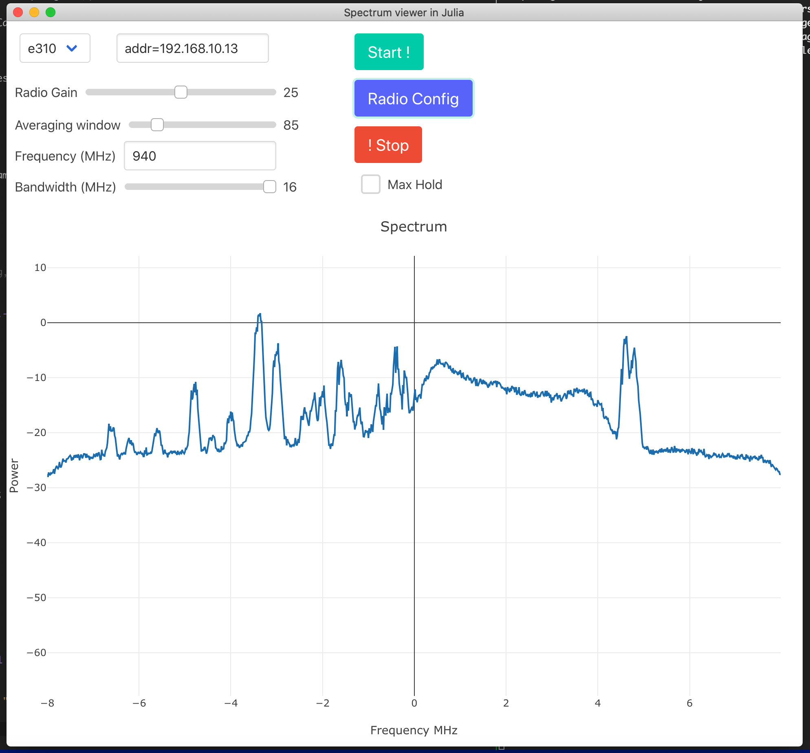

# AbstractSDRsSpectrum.jl  

## Overview and supported backends

This small package aims to propose some tools to peform spectral analysis with the use of Software Defined Radio (SDR). It provides a real time Discrete Fourier Transform (DFT) output (square magnitude).
This package leverage the use of AbstractSDRs.jl package and provides the same interface for differnt SDR backends.

The package provides 2 way for manipulating the parameters associated to the spectral analysis, with command line interface (CLI) and through a Graphical User Interface (GUI)

The supported backends are the ones supported by AbstractSDRs.jl


## Installation 


The package can be installed with the Julia package manager.
From the Julia REPL, type `]` to enter the Pkg REPL mode and run:

```
pkg> add AbstractSDRs 
```

Or, equivalently, via the `Pkg` API:

```julia
julia> import Pkg; Pkg.add("AbstractSDRsSpectrum")
```


## Commmand line Interface 


The spectral analysis tools can be use with the following command 
```
   AbstractSDRsSpectrum.start(:sdr,carrierFreq,samplingRate,gain;keywords);
```
Where `:sdr` is the SDR backend, `carrierFreq` is he desired carrier frequency, `samplingRate` is the desired rate and `keywords` are the keywords supported by the desired SDR backend.
To stop the current run, do `AbstractSDRsSpectrum.stop()`.
A GR instance will spawn with the power spectral density updated as fast as possible. It is possible to update the radio parameters on the fly by using the different proposed macros namely 
- `@updateCarrierFreq xxx` with xxx in Hz to update the carrier Frequency 
- `@updateSamplingRate xxx` with xxx in Hz to update the sampling Rate 
- `@updateGain xxx` with xxx in dB to update the radio gain (if supported) 
- `@updateMean xxx` to update the smoothing factor. It corresponds to the number of consecutive buffers used for averaging the computed power spectral density. 

## Graphical User Interface 

It is possible to use a graphical user interface to have the rendering of the PSD and be able to update the parameters of the radio. The GUI is based on Blink.jl and Interact.jl 
The GUI can be launched with the command `AbstractSDRsSpectrum.gui()`.

The GUI looks like the following image. Parameters can be updated on the fly.


The size of the window can be changed by the following command 
` @eval AbstractSDRsSpectrum WINDOW_SIZE=(400,200)`
and the plot size of the PSD by 
` @eval AbstractSDRsSpectrum PLOT_SIZE=(400,200)`
The maximal supported band can be updated with the command 
` @eval AbstractSDRsSpectrum MAX_BANDWIDTH=100e6`

## Installation 


The package can be installed with the Julia package manager.
From the Julia REPL, type `]` to enter the Pkg REPL mode and run:

```
   pkg> add AbstractSDRsSpectrum 
   ```

      Or, equivalently, via the `Pkg` API:

      ```julia
      julia> import Pkg; Pkg.add("AbstractSDRsSpectrum")
      ```


